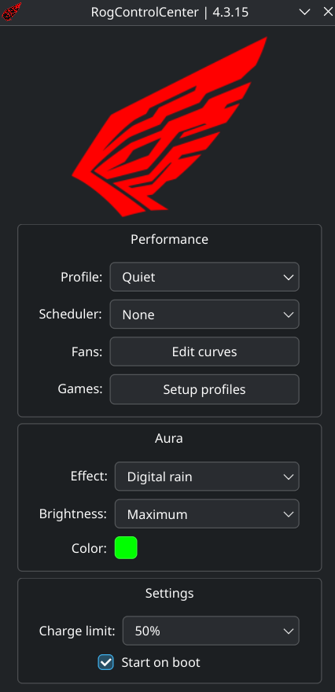
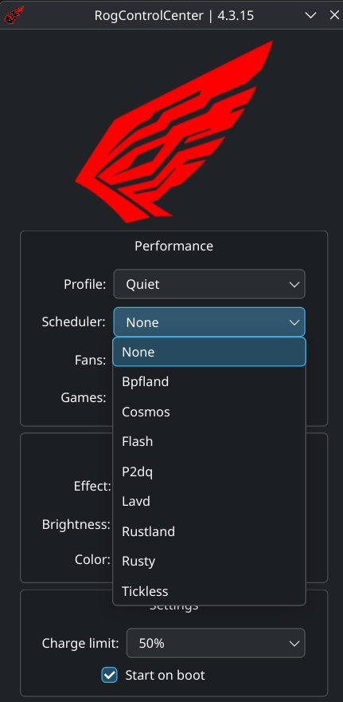
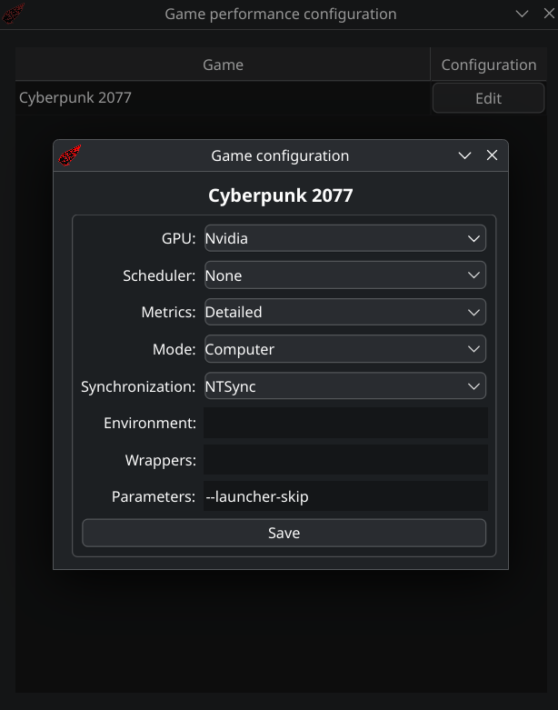

<h1 align="center">

  <br>
  RogControlCenter
  <br>  
  <p align="center">
    <a href="https://github.com/Emiliopg91/RogControlCenter/releases"></a>
    <a href="https://github.com/Emiliopg91/RogControlCenter/actions/workflows/release.yml"></a>
    <a href="https://deepwiki.com/Emiliopg91/RogControlCenter"></a>
    <br>
  </p>
</h1>

## Index

- [Description](#description)

- [Screenshots](#screenshots)
  
- [Features](#features)

- [Installation](#installation)
  - [AppImage version](#appimage-version) 
  - [PKGBUILD version](#pkgbuild-version) 
  - [Steam and DeckyLoader integration](#steam-and-deckyloader-integration) 

- [Compatibility](#compatibility)

- [Attribution](#attribution)

## Description

Are you tired of having to manually adjust operating system settings to get the most out of your Asus ROG?

Do you want breathtaking RGB effects on your laptop and peripherals? And with synchronized effects across all your RGBs?

What if I told you you can also integrate with Steam and assign which GPU to use from a graphical interface, and view performance metrics?

RogControlCenter is here to simplify your life and help you enjoy gaming on your Asus ROG laptop once and for all.

Do you want something similar for Asus Rog Ally/Ally X? Check [AllyDeckyCompanion](https://github.com/Emiliopg91/AllyDeckyCompanion/)

## Screenshots
|  |  |
|---|---|
|  |  |S

## Features

- [x] Selection of three performance profiles, which control:

  - CPU TDP
  - CPU Boost
  - CPU Governor
  - CPU Scheduler
  - GPU TGP
  - GPU Thermal throttling policy
  - Fan curves, customizable via charts
  - Power profile
  - SSD IO scheduler

- [x] RGB control for Asus ROG laptops and peripherics and support for custom AuraSync

- [x] Available RGB effects:

  - **Breathing**: Feel every breath
  - **Dance floor**: Every led dancing at rithm
  - **Digital rain**: Matrix like animation that speeds up as your CPU is more demanded
  - **Drops**: Feel every drop of rain fallin over you
  - **Gaming**: Highlights most used in game keyboard keys
  - **Rainbow wave**: A rainbow sliding on your leds
  - **Spectrum cycle**: A cycle of every color of RGB spectrum
  - **Starry night**: Stars blinking on your devices
  - **Static**: A classic solid color effect

- [x] Select color for the effect (only available on Breathing, Digital Rain and Static effect)

- [x] Allow changing RGB brightness

  - Off
  - Low
  - Medium
  - High

- [x] Limit battery charge threshold to maintain its life-span

  - 100%: If you requires full battery without bothering about its health
  - 75%: If you want big battery capacity saving its health
  - 50%: for laptops that are always connected to AC

- [x] Wrapper to apply optimization to applications (standard and flatpak)

- [x] Steam integration through Decky plugin

  - Interception of game first run to change it's launch option to use our custom wrapper
  - Force use of dGPU or letting Linux select for you
  - Show performance metrics
  - Adjust process CPU and IO priority
  - Support for flatpak added

- [x] Start on boot

- [x] Autoupdates

- [x] AppImage or PKGBUILD for AUR

## Installation

### AppImage version
For full support of this application, run the following command to install the dependencies:

```bash
sudo pacman -S --needed asusctl coreutils fuse2 hicolor-icon-theme hidapi libsecret libusb mbedtls power-profiles-daemon python python-pip qt5-base qt5-tools qt6-base qt6-charts qt6-svg scx-scheds upower
```

Once you installed those packages, you can run the AppImage with support for every feature.

### PKGBUILD version

You can use any AUR helper (tested on yay and paru) to make a local installation of the package.
That process performs installation of every dependency.

### Steam and DeckyLoader integration 

To enable Steam integration, you should install Steam and DeckyLoader previous to the first run of RogControlCenter. If you've already launched RogControlCenter you can delete ~/.RogControlCenter and perform Steam and DeckyLoader installation.

## Compatibility

- Tested on CachyOS and Bazzite with KDE desktop environment
- Only tested on Laptops with Intel+Nvidia settings

## Attribution

Thanks to the following for making this plugin possible:

- [Bazzite](https://github.com/ublue-os/bazzite/) thank you because you made Linux gaming beautiful for me

- [Asusctl](https://gitlab.com/asus-linux/asusctl/) for giving the base for performance profiles

- [OpenRGB](https://gitlab.com/CalcProgrammer1/OpenRGB/) base of the custom version for this project

- [MangoHUD](https://github.com/flightlessmango/MangoHud/) used for showing performance metrics in-game

- [Gamemode](https://github.com/FeralInteractive/gamemode/) to give inspiration about game processes optimizations

- [Decky loader](https://github.com/SteamDeckHomebrew/decky-loader/) for allowing Steam integration
